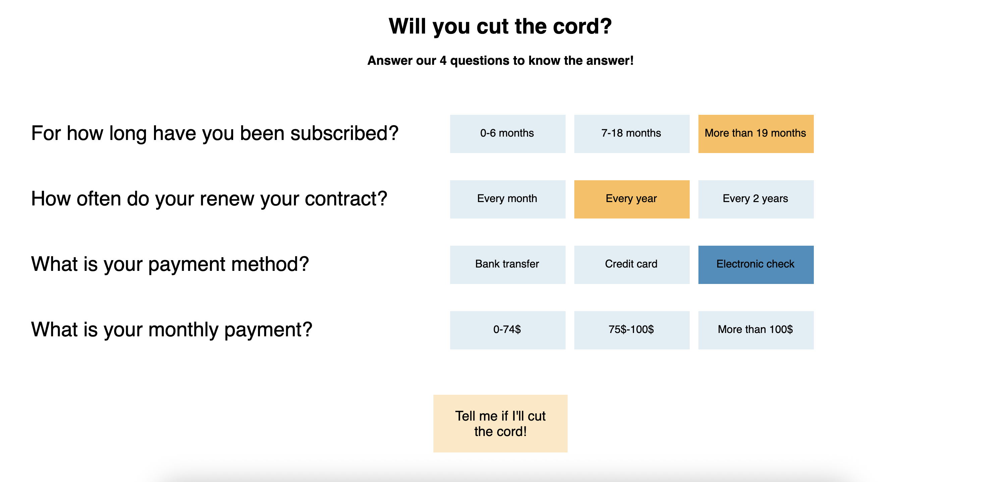
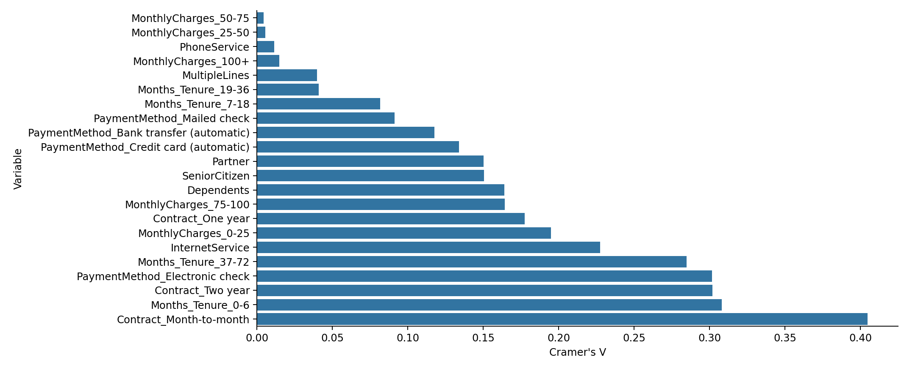

# Customer Churn Predictor 📊

Machine learning project predicting telecommunications customer churn with interactive web interface for real-time predictions.

**🌐 Live Demo:** https://predictchurn.juleslemee.com

## What It Does

The Customer Churn Predictor helps telecommunications companies identify customers likely to cancel their service. Users answer 4 simple questions about their subscription, and the ML model instantly predicts their churn probability.



*Interactive web interface allowing real-time churn predictions*



*Statistical analysis and model visualization*

## Why This Project Exists

**The Problem:** Telecommunications companies lose billions annually due to customer churn. Identifying at-risk customers early allows companies to take proactive retention measures, potentially saving thousands in lost revenue per customer.

**Our Solution:** This project demonstrates how machine learning can solve real business problems by predicting churn probability based on simple customer characteristics. Instead of waiting for customers to leave, companies can identify and engage at-risk customers proactively.

**Academic Context:** Developed and presented at HEC Montréal under AI Scientist Jonathan Moatti's oversight, this project showcases practical application of data science techniques including SMOTE, logistic regression, and interactive web deployment.

**Personal Learning Goals:** This project allowed our team to experience the full data science pipeline - from raw data cleaning to deployed web application - while solving a genuine business challenge faced by telecommunications companies worldwide.

## Dataset

Using the [Telco Customer Churn dataset](https://www.kaggle.com/datasets/yeanzc/telco-customer-churn-ibm-dataset) from Kaggle, which includes:
- 7,043 customer records
- 20+ features including demographics, services, and billing information
- Binary churn indicator (Yes/No)

## Features Analyzed

- **Demographics**: Gender, age range, dependents
- **Services**: Phone, internet, streaming subscriptions
- **Account Info**: Contract type, payment method, tenure
- **Financial**: Monthly charges, total charges

## Technical Implementation

### Data Processing
- **Data Cleaning**: Removed irrelevant variables and handled missing values
- **Categorical Encoding**: Applied one-hot encoding to convert categorical variables into binary format
- **Class Balancing**: Used SMOTE (Synthetic Minority Oversampling Technique) to address limited churn cases
- **Threshold Optimization**: Adjusted classification threshold for optimal churn prediction

### Machine Learning Models
We chose **Logistic Regression** as our final model over Cox regression based on database constraints and project goals, achieving:
- **80% accuracy** for non-churn prediction
- **70% accuracy** for churn prediction

Other models explored:
- Random Forest
- Gradient Boosting  
- Support Vector Machines

### Interactive Web Application
Built with Python's Flask library, the web interface allows users to:
- Input their telecommunications service parameters
- Get real-time churn probability predictions
- Experience the model that was demonstrated to classmates during our HEC Montréal presentation

## Key Findings

- Contract type is the strongest predictor of churn
- Month-to-month customers have 3x higher churn rate
- Electronic check payment correlates with higher churn
- Fiber optic internet customers show higher churn (possibly due to service issues)

## Key Features

✅ **Real-time Predictions** - Instant churn probability calculation  
✅ **User-friendly Interface** - Simple 4-question form  
✅ **Production Ready** - Deployed with custom domain  
✅ **Proven Accuracy** - 80% accuracy on non-churn, 70% on churn cases  
✅ **Academic Rigor** - SMOTE technique for handling imbalanced data  
✅ **Full Documentation** - Complete analysis in Jupyter notebook  

## Project Structure

```
customer-churn-predictor/
├── app.py                # Main Flask application
├── api/                  # Vercel serverless functions
├── templates/            # HTML templates
├── static/              # CSS stylesheets
├── bigfile.ipynb       # Complete data analysis
├── requirements.txt     # Python dependencies
└── interface.png        # App screenshot
```

## How to Get It Running

### Prerequisites
- Python 3.8+ installed on your system
- Git for cloning the repository

### Installation & Setup

1. **Clone the Repository**
   ```bash
   git clone https://github.com/juleslemee/customer-churn-predictor.git
   cd customer-churn-predictor
   ```

2. **Install Dependencies**
   ```bash
   pip install -r requirements.txt
   ```

3. **Run the Web Application**
   ```bash
   python app.py
   ```

4. **Access the Interface**
   Open your browser and visit: `http://localhost:5000`

### Optional: Jupyter Analysis
To explore the data analysis and model development:
```bash
jupyter notebook bigfile.ipynb
```

### Using the Live Demo
Skip local setup entirely by visiting the live version: https://predictchurn.juleslemee.com

## Results

- **Final Model**: Logistic Regression
- **Non-Churn Accuracy**: 80%
- **Churn Detection Accuracy**: 70%
- **Key Achievement**: Successfully demonstrated live predictions to classmates at HEC Montréal
- **Interactive Demo**: Deployed web application for real-time churn prediction

## Technologies Used

- **Data Science**: scikit-learn, pandas, matplotlib
- **Machine Learning**: Logistic Regression, SMOTE
- **Web Development**: Flask, HTML/CSS
- **Deployment**: Custom domain hosting

## Contributors
Jules Lemée
Maxence Dhondt
Cyprien Boustiha
Sandrine Trinh

